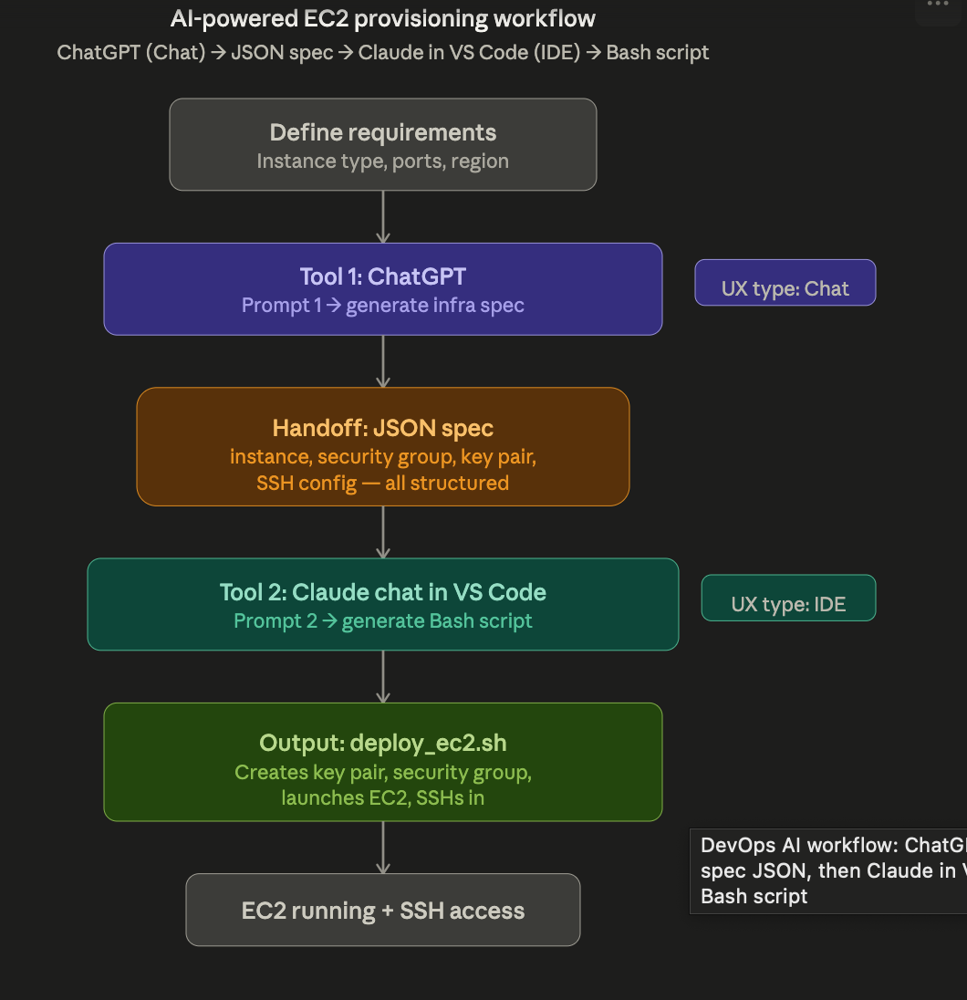

# Multi-Stage AI Workflow

> Automated EC2 provisioning using two AI tools chained together.

---

## Table of Contents

- [1. Problem Statement](#1-problem-statement)
- [2. Tools Selected](#2-tools-selected)
- [3. Step-by-Step Workflow](#3-step-by-step-workflow)
- [4. Why This Workflow Works](#4-why-this-workflow-works)

---

## 1. Problem Statement

Provisioning an EC2 instance with proper security groups, key pairs, and SSH access on AWS is a repetitive, manual process that DevOps engineers perform frequently. Each time, the engineer must remember the correct AWS CLI commands, security group rules, key pair management steps, and the right sequence to tie them together. This is error-prone (wrong ports, forgotten key permissions, mismatched names) and time-consuming.

**Goal:** Automate this entire process using two AI tools chained together. A Chat AI generates a structured JSON specification from plain-English requirements, and a CLI AI converts that spec into a production-ready Bash script that provisions everything end-to-end.

**Workflow overview screenshot:**



---

## 2. Tools Selected

| Tool | UX Type | Purpose |
|------|---------|---------|
| ChatGPT chat | Chat AI | Generate structured JSON infrastructure spec from plain-English requirements |
| Claude chat in VS Code | Chat AI | Convert the JSON spec into a complete, executable Bash provisioning script |

---

## 3. Step-by-Step Workflow

### Step 1: Run Prompt 1 in ChatGPT Chat

> You are an AWS infrastructure architect. I need to provision an EC2 instance. Based on my requirements below, generate ONLY a valid JSON object (no other text) with this exact structure:

```json
{
  "project_name": "string",
  "region": "string",
  "instance_type": "string",
  "ami_id": "string (use latest Ubuntu 22.04 for the region)",
  "key_pair_name": "string",
  "security_group": {
    "name": "string",
    "description": "string",
    "inbound_rules": [{ "port": "number", "protocol": "tcp", "cidr": "0.0.0.0/0", "description": "string" }]
  },
  "tags": { "Environment": "string", "Owner": "string" }
}
```

> My requirements: I need a t2.micro Ubuntu instance in us-east-1 for a web server project called "my-web-app". Open ports 22 (SSH) and 80 (HTTP). Tag it as Development, owned by [your name].

**Screenshot from ChatGPT chat:**


---

### Step 2: Run Prompt 2 in Claude Chat in VS Code

> You are a senior DevOps engineer. Below is a JSON infrastructure spec for an AWS EC2 instance. Generate a complete, production-ready Bash script called `deploy_ec2.sh` that does the following in order:
>
> 1. Sets the AWS region from the spec
> 2. Creates the key pair, saves the .pem file, and sets `chmod 400`
> 3. Creates the security group with the specified inbound rules
> 4. Launches the EC2 instance with the key pair and security group
> 5. Waits for the instance to be in 'running' state
> 6. Retrieves the public IP and prints the SSH command
> 7. Applies all tags from the spec
>
> **Requirements:** use `set -euo pipefail`, include error handling, add comments explaining each section, include a cleanup function, and make it idempotent (check if resources exist before creating).
>
> **JSON Spec:** `[PASTE JSON HERE]`

**Screenshot from Claude chat in VS Code:**


---

### Step 3: Copy the JSON Output

The Chat AI will return a complete JSON object. Copy it exactly as outputted. This is the handoff artifact — the structured data that bridges Tool 1 to Tool 2.

---

### Step 4: Test and Execute

Save the CLI AI output as `deploy_ec2.sh`, make it executable (`chmod +x deploy_ec2.sh`), and run it. Verify that the EC2 instance launches, the security group has correct rules, and you can SSH in using the generated key pair.

> **Tip:** If anything fails, feed the error message back to the CLI AI and ask it to fix the script. This iterative refinement is a key part of the workflow.

---

## 4. Why This Workflow Works

### Functionality

The flow is concrete and testable. You paste Prompt 1 into ChatGPT chat, get a valid JSON object, paste that JSON into Prompt 2 in Claude chat in VS Code, and get a runnable Bash script. Each step has a clear input and output, and the screenshots show the chain from prompt to result.

### Efficiency

The workflow reduces manual effort. Provisioning an EC2 instance with key pairs, security group rules, permissions, and tags usually takes repeated AWS CLI lookups and careful typing. This prompt chain turns that into a reusable process that produces a commented, idempotent deployment script much faster and with fewer mistakes.

### Adaptability

The logic is tool-agnostic. The JSON handoff is a universal format, so the same pattern can work with different chat tools, different CLI assistants, or even a different infrastructure target such as Terraform or Azure. The structure stays valid even if the specific vendor changes.

---

**Screenshot of the successful script run:**


